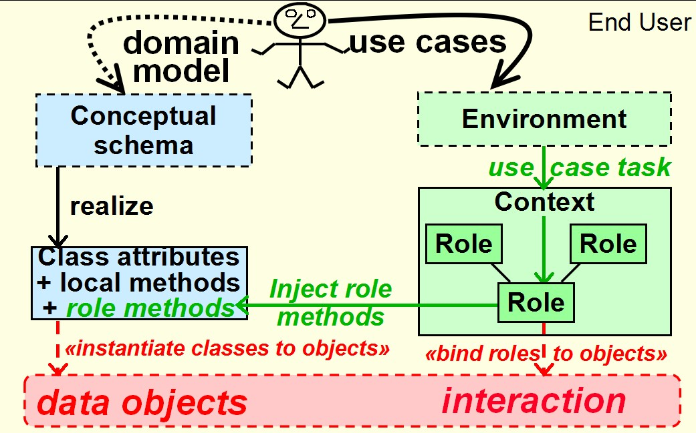
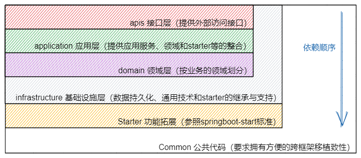

# ddd

[](https://gitee.com/EricFox/ddd)

## 介绍

一个ddd思维，充血模型实现的项目 [https://gitee.com/EricFox/ddd](https://gitee.com/EricFox/ddd)

### 基本理念

- 避免"基于数据库编程"，领域层的entity并不对应数据库表，虽然会在入库的时候做转换，但业务变化并不直接导致数据库变化
- 积极采用策略设计模式，结合注解，延长项目寿命
- 多采用防腐层隔离服务与业务
- 领域的划分是基于具体业务的，而非服务
- 本项目采用的DCI设计模式，适用于业务较为复杂的项目，若项目不大则还应该用MVC模式
- 复杂的结构和频繁的反射，导致了对开发人员的素质要求较高，使用前的培训是必要的
- 只使用最佳方案，拥抱新的协议和技术，优先轻量级实现，因为AOP的思想，所以若是比较重的技术如果层次抽象的好。也可采用

## 软件结构

### DCI设计模式 + 四色原型模式

- 图示
  
- 描述：什么类型的(Description) + 谁/什么地点/什么东西(PartPlaceThing) + 以什么角色(Rule) + 在什么时间(Moment) + 做什么(
  Interaction)

### 系统依赖关系图示



### 目录层级说明

```text
- ddd-api API接口层
	- model 视图模型，数据模型定义 vo/dto
	- assembler 装配器，实现模型转换eg. apiModel <--> domainModel
	- controller 控制器,对外提供（RestFUL）接口
- ddd-application 应用层
	- service 应用服务，非核心服务
	- task 任务定义
	- * others 其他
- ddd-domain-* 领域层
	- common 公共代码抽取，限于领域层有效
	- events 领域事件
	- model 领域模型
		- [sys_user] 领域划分的模块，可理解为子域划分
			[SysUser]Context.java 上下文定义，定义DCI模式中的：类型（Description）、角色（Rule）、时间（Moment）
			[SysUser]Entity.java 领域值实体，继承EntityBase，可以增加更多业务字段、定义和Po的转换关系，扮演DCI模式中的主语：谁/什么地点/什么东西（PartPlaceThing）
			[SysUser]EntityBase.java 领域值实体，充血的领域模型，如本身的CRUD操作在此处，由代码生成器创建
			[SysUser]Service.java 子域服务，继承ServiceBase，可以定义更多
			[SysUser]ServiceBase.java 子域服务，扮演DCI模型中的：交互事件（Interaction），由代码生成器创建
	- service 领域服务类，一些不能归属某个具体领域模型的行为
	- factory 工厂类，负责复杂领域对象创建，封装细节
- ddd-infrastructure 基础设施层
	- general 通用技术支持，向其他层输出通用服务
		- common 基础公共模块等
		- config 配置类
		- toolkit 工具类
	- persistent 持久化机制
		- po 持久化对象
		- dao 仓储类，持久化接口&实现，可与ORM映射框架结合
	- service 实现简单的基础服务，更复杂的功能由starter实现，可在此处做简单整合与拓展
- ddd-starter-* 功能拓展starter
	- config 模块配置类
	- interfaces 接口类
	- pattern 设计模式所需的类
	- properties 配置文件类
	- service 应用service
	*Autoconfig.java 自动装配类
- ddd-common 公共模块（能写进该模块的类需要有一个共同的理念：可移植性强，即就算把代码粘贴到其他项目，哪怕架构不太一样也能轻易改好使用）
	- annotations 注解类
	- enums 枚举类
	- exceptions 异常类
	- interfaces 接口类
	- toolkit 工具类
```

## 关于RSocket

- [Google图书-《Hacking with Spring Boot 2.3: Reactive Edition》](https://books.google.com.hk/books?id=7VbjDwAAQBAJ&pg=PT170&dq=ResponseEntity.created(URI.create(&hl=zh-CN&sa=X&ved=2ahUKEwillab76tr5AhWJUt4KHYGKCTYQ6AF6BAgFEAI#v=onepage&q&f=false
  )

## 安装教程

#### 使用说明

#### 参与贡献

#### 特技

1. 使用 Readme\_XXX.md 来支持不同的语言，例如 Readme\_en.md, Readme\_zh.md
2. Gitee 官方博客 [blog.gitee.com](https://blog.gitee.com)
3. 你可以 [https://gitee.com/explore](https://gitee.com/explore) 这个地址来了解 Gitee 上的优秀开源项目
4. [GVP](https://gitee.com/gvp) 全称是 Gitee 最有价值开源项目，是综合评定出的优秀开源项目
5. Gitee 官方提供的使用手册 [https://gitee.com/help](https://gitee.com/help)
6. Gitee 封面人物是一档用来展示 Gitee 会员风采的栏目 [https://gitee.com/gitee-stars/](https://gitee.com/gitee-stars/)

## ddd #TODO list

- [X]  缓存问题

- [X]  Caffeine一级缓存
- [X]  Redis二级缓存
- [X]  策略设计模式
- [X]  并发下的同步，CP和AP的取舍

- [Redis注解集成之解决@CacheEvict只能单一清除的扩展 -模糊清除多条缓存](https://blog.csdn.net/qq_33454884/article/details/89330649)
- [Caffeine 详解 —— Caffeine 使用](https://zhuanlan.zhihu.com/p/329684099)
- [X]  整合MQ

- [X]  RabbitMQ
- [X]  Kafka
- [ ]  持久化问题

- [ ]  ~~分库分表~~(可选)
- [ ]  整合MongoDB方式的持久化
- [ ]  整合HDFS或HBase
- [X]  整合MySQL
- [X]  整合lucene
- [X]  策略设计模式
- [ ]  常用功能

- [X]  整合OAuth2
- [ ]  流式传输
- [ ]  对toml相关的探索
- [X]  工作流
- [X]  代码生成
- [X]  日志方案
- [X]  分布式/微服务

- [X]  整合RSocket
- [X]  整合Zookeeper注册服务
- [X]  整合Eureka注册服务
- [X]  支持starter拓展
- [ ]  安全问题

- [ ]  用户认证相关策略
- [ ]  防止CSRF Cookies攻击（CSRFProtect）
